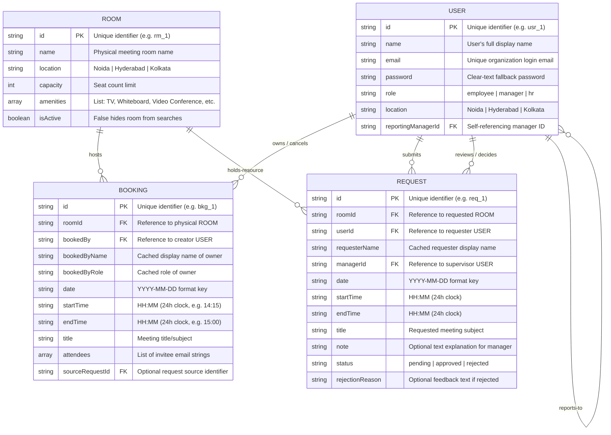
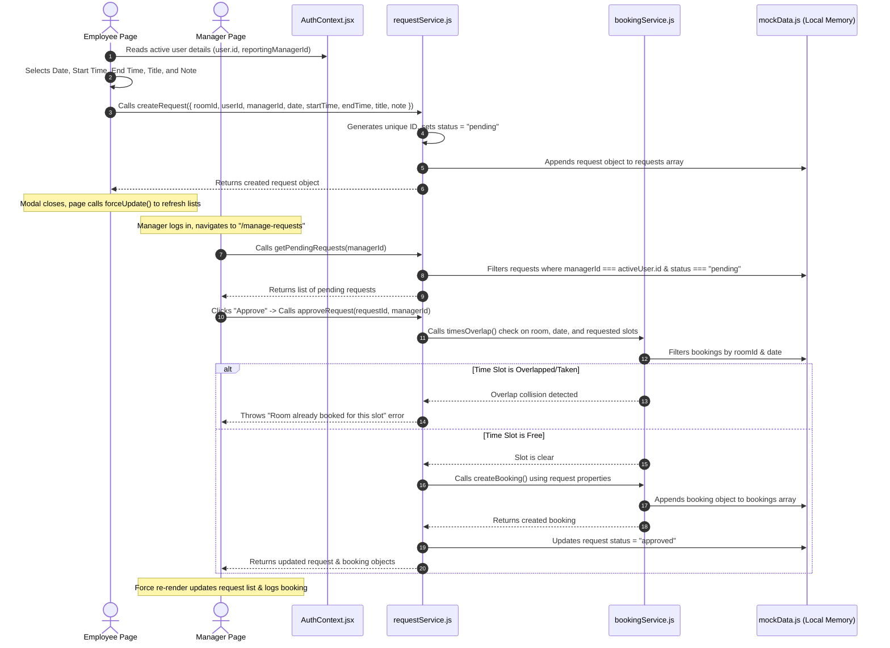
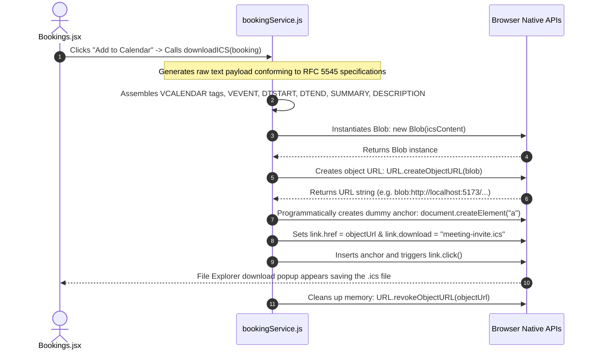

# System Architecture & Diagrams (Detailed Reference)

This document contains detailed visual diagrams mapping out the data schema, programmatic execution flows, and user interaction pathways of the Meeting Room Booking System.

---

## 1. Detailed Entity-Relationship (ER) Diagram
This diagram shows the complete representation of the database tables (simulated in `mockData.js`), including secondary columns, data types, and primary/foreign key mappings.

---

## 2. Low-Level Sequence Diagrams

### A. Employee Booking Request & Manager Approval Flow
This diagram details the step-by-step logic, function calls, and state transitions that occur when an Employee requests a room and a Manager approves it.

---
### B. Calendar Export (.ics) Sequence
This diagram details how the application generates and initiates a local calendar file download completely inside the browser client without server dependencies.

---

## 3. High-Level User Flow Diagram
The flowchart below maps out the application pathways, including the role gates and dynamic locations lockouts.

