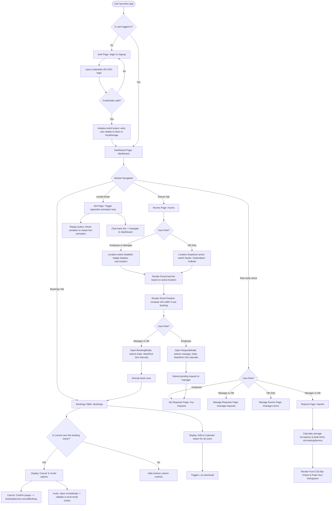

# System Architecture & Diagrams (Detailed Reference)

This document contains detailed visual diagrams mapping out the data schema, programmatic execution flows, and user interaction pathways of the Meeting Room Booking System.

---

## 1. High-Level User Flow Diagram
The flowchart below maps out the application pathways, including the role gates and dynamic locations lockouts.

